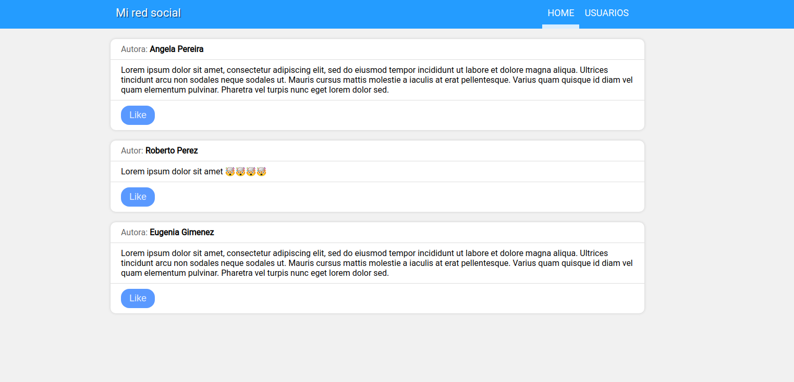
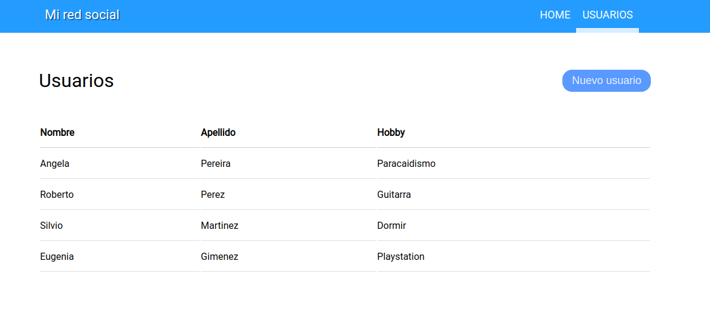
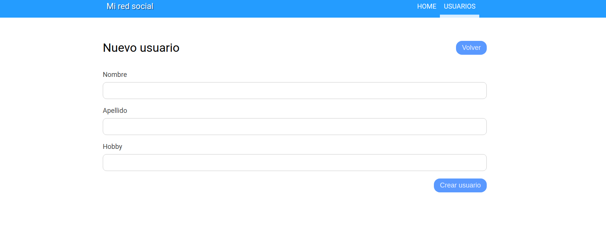

# HTML y CSS

[Referencia](referencia.md)

## Temario

- HTML basics (tags, atributos)
- Estructura básica de un documento (html, head, body, title)
- HTML 5 boilerplate
- Etiquetas comunes a, p, img, h*, br
- En bloque vs en linea div, span
- Etiquetas de layout header, nav, section, article
- CSS basics (selectores, propiedades)
- Selectores (etiqueta, id, clase, atributo)
- Box model (margin, padding, border, background)
- Tablas
- Formularios form, input, checkbox, radio, button
- Propiedades comunes (color, font-family, font-size, text-align)
- Selectores avanzados (union, hijos, :hover)
- Posicionamiento (static, relative, absolute, fixed, top, left, bottom, right)
- Flexbox (https://css-tricks.com/snippets/css/a-guide-to-flexbox/)

## Ejercicio

Hacer un sitio web que contenga:
  - Una página home con tres posts de usuarios. Cada post debe tener el nombre del autor/a, un contenido textual y un boton de like.
  - Una página de usuarios donde se vea una tabla con datos de los usuarios. Los datos son: nombre, apellido y hobby. Además, debe haber un botón de crear usuario que lleve a la página de creación de usuario.
  - Una página de creación de usuario que sea un formulario con los campos que hacen a un usuario: nombre, apellido y hobby. Debe haber una forma de volver de la página de creación de usuario a la página que muestra los usuarios en una tabla.
  - Todas las páginas deben tener el mismo header que permita navegar entre la home y la lista de usuarios.
  - Ninguno de los botones es necesario que funcione, excepto los que hagan que sirvan para navegar entre las diferentes páginas.

Este es un ejemplo de como quedaría, **no es necesario que lo hagan exáctamente igual**, mientras sigan las consignas textuales pueden hacerlo como más les guste.

